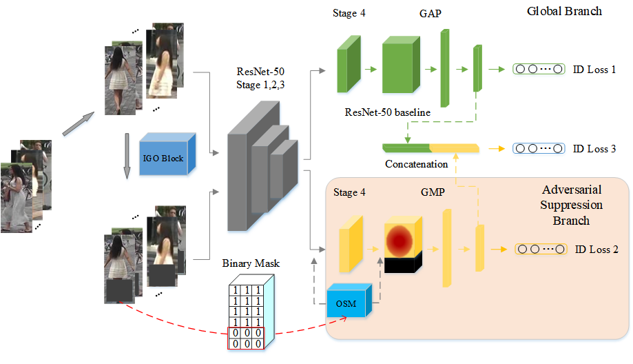

# Incremental Generative Occlusion Adversarial Suppression Network for Person ReID (IEEE TIP 2021) 

This is the pytorch implementation of the [paper](https://ieeexplore.ieee.org/abstract/document/9397375) (accpted by IEEE TIP 2021). More information about the paper is in [here](https://shuguang-52.github.io/igoas/).



**Fig 1**.IGOAS framework

# Installation

Make sure [conda](https://www.anaconda.com/distribution/) is installed.

    # cd to your preferred directory and clone this repo
    git clone https://github.com/Vill-Lab/IGOAS.git
    
    # create environment
    conda create --name torchreid python=3.7
    conda activate torchreid
    
    # install dependencies
    # make sure `which python` and `which pip` point to the correct path
    pip install -r requirements.txt
    
    # install torch and torchvision (select the proper cuda version to suit your machine)
    conda install pytorch torchvision cudatoolkit=9.0 -c pytorch
    
    # install torchreid (don't need to re-build it if you modify the source code)
    python setup.py develop


## Reference
This code is based on [torchreid](https://github.com/KaiyangZhou/deep-person-reid).


## Citation 
If you find IGOAS useful in your research, please consider citing.

```
@article{tip21,
   author = {Zhao, Cairong and Lv, Xinbi and Dou, Shuguang and Zhang, Shanshan and Wu, Jun and Wang, Liang},
   title = {Incremental Generative Occlusion Adversarial Suppression Network for Person ReID},
   journal = {IEEE transactions on image processing : a publication of the IEEE Signal Processing Society},
   volume = {30},
   pages = {4212-4224},
   DOI = {10.1109/tip.2021.3070182},
   url = {<Go to ISI>://MEDLINE:33822724},
   year = {2021},
   type = {Journal Article}
}
```


